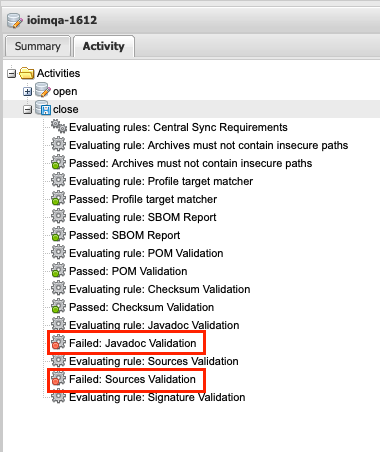

# 자바 프로젝트에서 라이브러리(jar) maven 배포

Android SDK Injector 프로젝트는 안드로이드가 아닌 자바로 개발된 프로젝트이다. 이것 또한 인수인계 과정에서 배포스크립트 마이그레이션이 정상적으로 이루어지지 않아 프로젝트 빌드도 안되고 배포도 안되는 상황을 겪고 있었다.

처음에는 배포스크립트 라이브러리를 `maven-publish`로 사용하려고 했었으나 안드로이드 gradle 특정 버전 이상에서만 사용가능 했다. 특히나 낮은 jdk환경과 gradle 버전이라면 `maven-publish`플러그인 사용이 쉽지 않았다.

그래서 `maven` 이라는 레거시 플러그인을 활용했고 이전에 한번 사용해봤기 때문에 스크립트 내용은 동일하게 사용하였다.

```
apply plugin: 'maven'
apply plugin: 'signing'

uploadArchives {
    repositories {
        mavenDeployer {
            beforeDeployment { MavenDeployment deployment -> signing.signPom(deployment) }

            repository(url: "https://s01.oss.sonatype.org/service/local/staging/deploy/maven2/") {
                authentication(userName: 'KeyID', password: 'User Token')
            }

            snapshotRepository(url: "https://s01.oss.sonatype.org/content/repositories/snapshots/") {
                authentication(userName: 'KeyID', password: 'User Token')
            }

            pom.project {
                name PUBLISH_ARTIFACT_ID
                packaging 'jar'
                // optionally artifactId can be defined here
                description 'This is the client sdk for android application'
                url 'https://coolishbee.io'

                scm {
                    connection = 'scm:https://private'
                    developerConnection = 'scm:git://private'
                    url = 'https://private'
                }

                licenses {
                    license {
                        name 'The Apache License, Version 2.0'
                        url 'http://www.apache.org/licenses/LICENSE-2.0.txt'
                    }
                }

                developers {
                    developer {
                        id 'jameschun7'
                        name 'james chun'
                        email 'chc3484@gmail.com'
                    }
                }
            }
        }
    }
}

signing {
    sign configurations.archives
}
```

이렇게 해서 스냅샷단계까지 가고 빌드과 작동 성공까지 됐으나

이런 오류가 발생되었다.



javadoc와 sources 유효성 검증에서 실패했다는 메시지다.

aar경우와는 다르게 jar는 소스를 포함해서 배포해야 한다는 내용을 찾게 되었다. [스택오버플로우를](https://stackoverflow.com/questions/11474729/how-to-build-sources-jar-with-gradle) 통해서 [여러 시도](https://discuss.gradle.org/t/publish-to-maven-repository/26138) 끝에 성공했다.

그러나 이번엔 빌드 실패....

```
error: reference not found
```

원인은 JavaDoc 컴파일 규칙에 맞지 않는 경우 즉, JavaDoc 문법오류 등 컴파일 에러의 원인이 될 수 있다고 한다. 그래서 컴파일 에러가 발생하더라도 중단되지 않도록 설정하는 옵션을 추가했다.

```
javadoc {
    failOnError false
    options {
        encoding 'UTF-8'
        charSet 'UTF-8'
        links 'https://docs.oracle.com/javase/8/docs/api/'

        addBooleanOption('Xdoclint:none', true)
    }
}
```

위 내용을 추가하여 무사히 배포할 수 있었다.