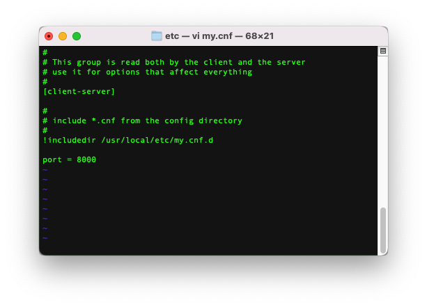

## [MariaDB/mysql] root 초기 비번 설정
### mariadb 접속
```
$ mysql
```

### mysql db 접근
```
[MariaDB [(none)]> use mysql
```

### root 비번 설정
```
// mysql 5.6 이하
[mysql]> set password for 'root'@'localhost' = PASSWORD('1234');
// mysql 5.7 이상
[mysql]> set authentication_string=password('new password') where user = 'root';
// mysql 8.x 이상
[mysql]> alter user 'root'@'localhost' identified with mysql_native_password by 'new password';

// mariadb 10.4 이상
[MariaDB [mysql]> set password=password('1234');
[MariaDB [mysql]> flush privileges;
```

### root 로그인
```
mysql -uroot -p1234
```

## [MariaDB] port 변경

## 설정파일 편집
```
$ vi /usr/local/etc/my.cnf
```



## 저장후 서비스 재시작
```
$ brew services restart mariadb
```

## 서비스 확인
```
$ brew services list
```

## port 변경확인
```
$ sudo lsof -i :8000
```
