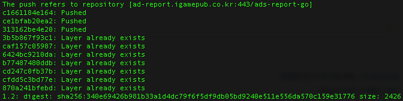

# Docker 빌드 및 배포 가이드

[공식사이트](https://golang.org/doc/install) 를 통해 설치합니다.

## Registry 구축

* [docker registry 설치](https://hub.docker.com/_/registry)
```
$ docker pull registry:latest
```

* docker registry 실행
```
$ docker run -d -p 5000:5000 --restart always --name docker-repo registry:latest
```

* registry 저장소 image 조회
```
$ curl -X GET [registry_url]//v2/_catalog
```

* registry 저장소 image tag 조회
```
$ curl -X GET [registry_url]/v2/[image_name]/tags/list
```

## Docker Build
### Dockerfile 구성
```
FROM golang:1.19

WORKDIR $GOPATH/src/ads-report-go
COPY . $GOPATH/src/ads-report-go
RUN go build .

ENTRYPOINT ["./ads-report-go"]
```

### Project Build

```
$ docker build -t ads-report-go .
```


## Docker tag 설정
```
$ docker tag ads-report-go ad-report.com:443/ads-report-go:1.1
```
## Docker push
```
$ docker push ad-report.com:443/ads-report-go:1.1
```

## Docker Image Pull
```
$ docker pull ad-report.com:443/ads-report-go:1.1
```
## Docker Run
```
$ docker attach $(docker run --name ads-admin -p 80:80 -it -d containerID)
```

