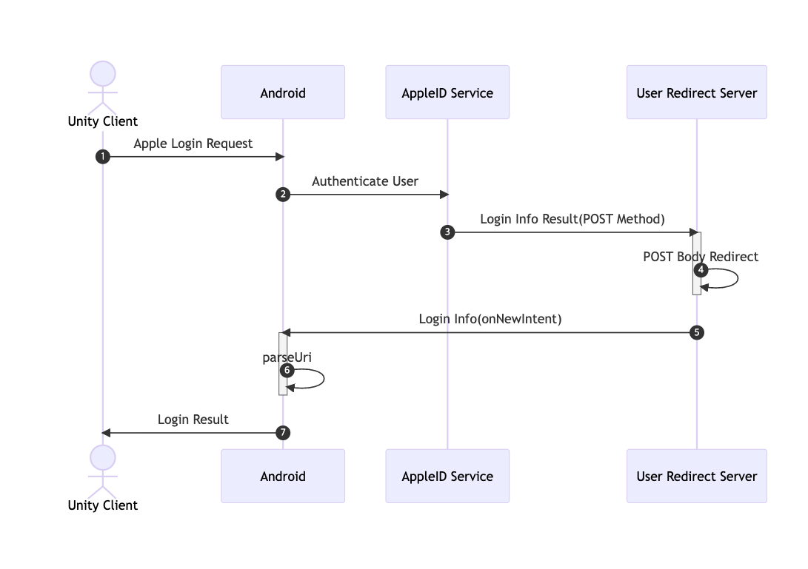

## Android Apple Login Flow



## Redirect Server

Go Example:
```
func AppleLoginRedirect(c *gin.Context) {
	if c.Request.Method == "POST" {
		strBody, err := io.ReadAll(c.Request.Body)
		if err != nil {
			log.Fatal(err)
		}
		log.Println(string(strBody))

		c.Redirect(http.StatusFound, "coolish://callback?"+string(strBody))
	}
}

//router
r := gin.New()
r.Any("/applelogin/redirect", AppleLoginRedirect)
```