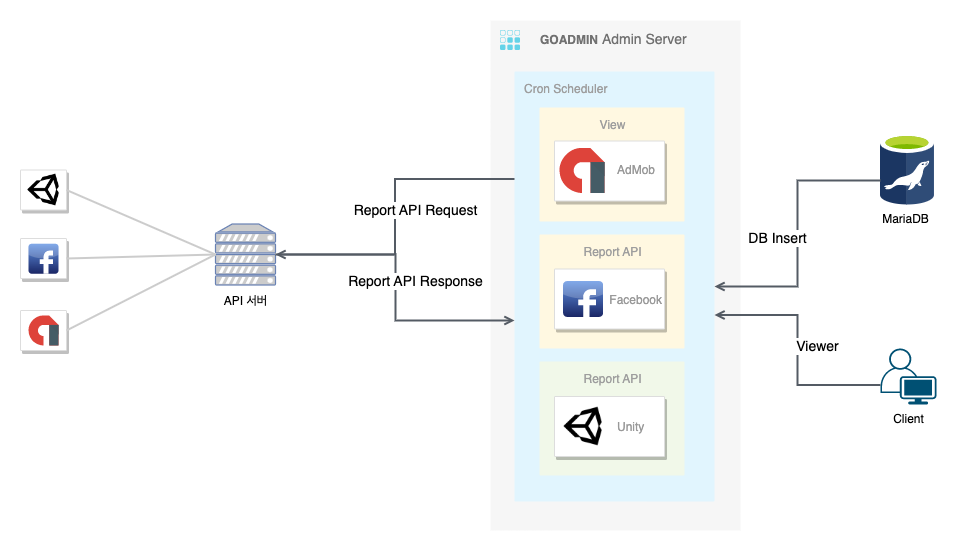

# 광고수익 보고서 Admin

## 개발 히스토리

사업부에서 매일 서비스 중인 게임들의 광고 수익을 지표로 만들고 있었는데 각 광고 수익 매체의 콘솔 사이트에 접속하여 원하는 데이터를 필터링 후 수기로 수집하고 있었다.
사업부는 이 작업으로 몇몇 인원들이 매일 2시간씩 소요되니 좀더 쉽게 자동화할 수 있는 방법이 없냐고 문의해왔다.

요구사항은 간단했다. 한 곳에서 모든 광고 매체의 광고수익 데이터들을 추출하게 해달라.

작업내역

* 각각의 광고매체 API 들을 이용하여 데이터베이스로 Insert.
* Admin 을 통해 원하는 데이터 검색기능 제공.
* 프로젝트, 기간별 필터링 기능과 CSV로 Export 제공.

## 설계

## 프로젝트 관리

* 도커로 배포
* 젠킨스 자동화 추가예정