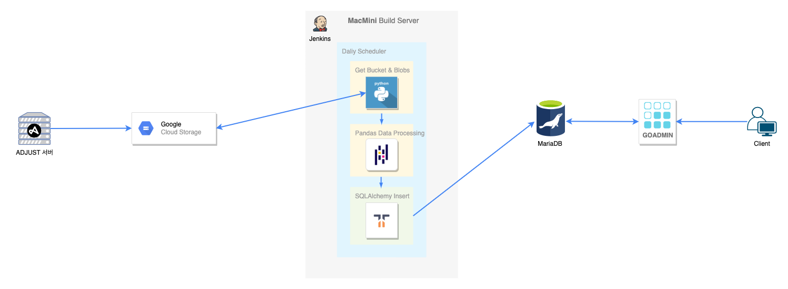

# Adjust 마케팅 지표 Admin

## 개발 히스토리

기존에는 Google Cloud Storage에 쌓이는 row Data들을 빅쿼리를 사용하여 csv로 추출하여 마케팅부서에 전달하고 있었다.

CSV row 데이터는 스토리지에 보관하고 있지만 빅쿼리사용시에 업로드한 데이터들은 비용문제로 인해 보관하고 있지 않았다.
그리고 빅쿼리를 사용하고 있었지만 row 데이터 그대로 전달하고 있었기 때문에 비싼 빅쿼리 기능이 제대로 활용되고 있지 않았다.
이를 해결하기 위해 두가지를 생각했다.

1. adjust row 데이터를 데이터베이스화 하여 사내 DB서버에 장기간 보관하자.
2. 보관된 DB를 마케팅부서에서 언제든 원하는 데이터를 보고 추출할 수 있게 제공하자.

였다. 그러나 row 데이터이다보니 불필요한 데이터(빈 컬럼)가 너무 많았다. 그래서 마케팅부서와 논의하여 필요한 데이터를 
정제 및 가공하는 작업을 거쳤고 이번에도 goadmin을 활용하여 데이터를 필터링하고 보고 추출할 수 있게 웹어드민을 제공했다.

## 설계

## 프로젝트 관리

* 젠킨스로 도커배포
* 젠킨스 빌드 배포 자동화