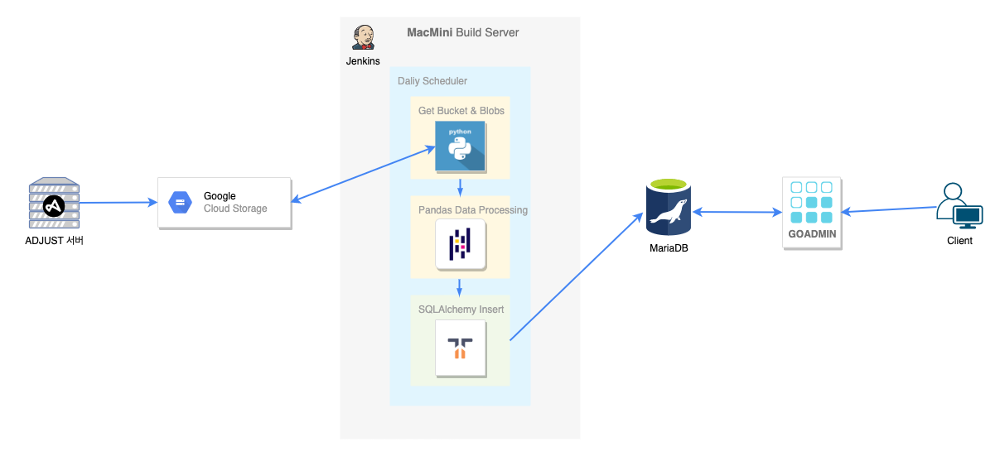

h1. Adjust 마케팅 지표 Admin

h2. 개발 히스토리

기존에는 Google Cloud Storage에 쌓이는 row Data들을 빅쿼리를 사용하여 csv로 추출하여 마케팅부서에 전달하고 있었다.

문제점

사내 데이터베이스에 adjust 데이터를 쌓아서 마케팅부서에서는 언제든 원하는 데이터를 추출할 수 있도록 했다.

h2. 설계

h2. 프로젝트 관리

* 저장소
* 젠킨스로 도커배포