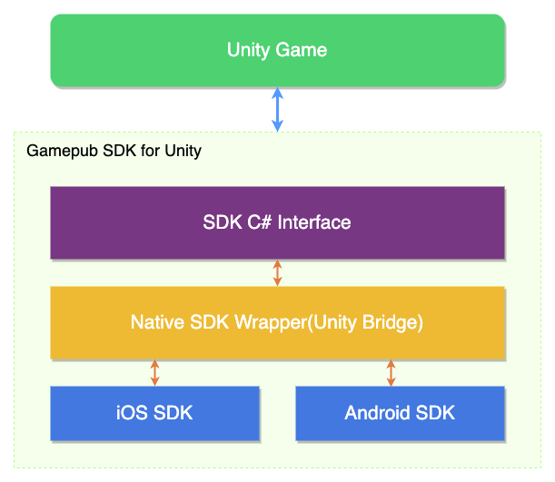
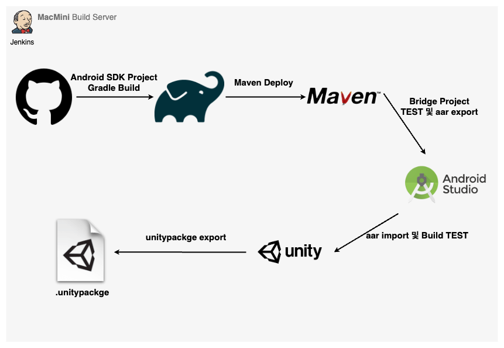
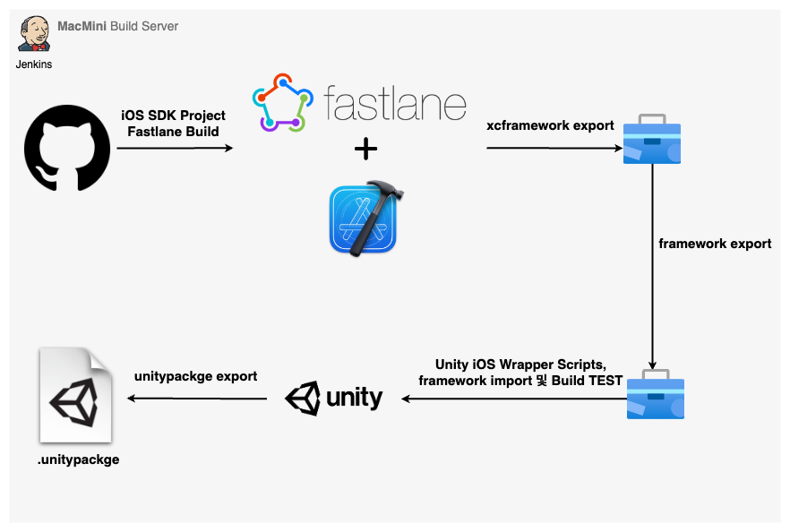

게임펍은 퍼블리싱 사업이 주된 사업으로 다양한 개발사와 협업하여 게임을 출시합니다.<br>
이에 따라 반복적인 기능들을 필요로 했고 나아가 사용자 경험을 쌓아 수익창출에 도움이 될 수 있는 SDK 가 필요했습니다.

## 개요

기존에 일회성으로 만들어 사용하던 Unity SDK 이 있었으나 각 써드파티들에 대한 의존성, 확장성, 호환성 이슈들이 예측됐고
c# 으로만 개발된 SDK 였기 때문에 네이티브 기능도 사용할 수 가 없었습니다.<br>
그래서 각각 iOS 와 Android 용 네이티브 SDK 를 개발하여 C# 인터페이스를 통해 Unity SDK 를 제공하기로 결정했습니다.<br>
현재 SDK 팀이 앞으로 어떻게 될지 모르겠지만 향후 언리얼 SDK 도 개발 가능하다는 이점을 가져가는 것도 목표중 하나였습니다.

기본적인 목표는 다른 유니티 SDK 와 같이 C# Interface로 Android, iOS 간에 차이 없이 사용 가능하게 제공하는 거였고
이를 위해 구성한 SDK 구조는 다음과 같습니다.



## Unity SDK

Unity에서는 그동안 계속해서 [네이티브 플러그인](https://docs.unity3d.com/kr/2021.3/Manual/Plugins.html)에 대한 지원이 발전되고 있었습니다. 이것을 이용해서 Native SDK 를 래핑하는 Unity용 Android Bridge 프로젝트를 만들었습니다.<br>
이렇게 했을 때 얻을 수 있는 장점은 사용자 API 인터페이스만 바뀌지 않는다면 네이티브 SDK 구현부 배포를 원격으로 할 수 있다는 점입니다.

### API 요청 방식

* iOS : Unity에서 제공되는 [iOS용 플러그인 빌드](https://docs.unity3d.com/kr/2021.3/Manual/PluginsForIOS.html)방식을 사용하여 각 네이티브 메서드를 호출합니다.
* Android : Unity에서 제공되는 [AndroidJavaObject](https://docs.unity3d.com/ScriptReference/AndroidJavaObject.html)를 사용하여 각 네이티브 메서드를 호출합니다.

=== "iOS interface"
    ```c#
    [DllImport("__Internal")]
    private static extern void login(string identifier);
    public static void Login(string identifier) {
        return login(identifier);
    }
    ```
=== "Android interface"
    ```c#
    public static void Login(string identifier) {
        var androidObject = new AndroidJavaObject("com.gamepubcorp.sdk.WrapperClass");

        object[] param = new object[1];
        param[0] = identifier;

        return androidObject.Call("login", param);
    }
    ```

### API 응답 방식

네트워크 통신이 있는 API 경우엔 비동기 콜백처리가 필요하므로 네이티브 쪽에서 Unity의 메서드를 호출할 수 있어야 합니다.
Unity에서는 Android와 iOS 마찬가지로 UnitySendMessage 메서드를 제공합니다.

UnitySendMessage 의 정의는 다음과 같습니다.

```
UnitySendMessage("GameObjectName1", "MethodName1", "Message to send");
```

* 호출할 대상의 GameObject의 이름
* 호출할 스크립트의 메서드
* 메서드 파라미터 문자열

이 메서드를 이용해서 토큰을 식별자로 사용하고, 데이터는 JSON 직렬화 파라미터를 사용해서 전달합니다.
여기서 전달된 데이터는 Unity 엔진 런타임의 생성된 Gamepub 객체(GameObject)에서 수신합니다.
수신하는 GameObject 의 종류는 성공, 실패로 나뉘며 직렬화된 데이터를 받아 역직렬화하여 객체로 캐스팅합니다.

Unity에서 이 콜을 받으려면

1. MonoBehaviour 을 상속받는 객체여야 합니다.
2. 그 객체(GameObject)는 Unity 엔진 런타임에 생성되어 있어야 합니다.
3. 해당 스크립트내에 MethodName이란 이름의 메서드가 정의되어 있어야 합니다.

식별자를 사용해서 네이티브 API를 호출하고, 동일한 식별자를 UnitySendMessage 메서드를 통해 반환하면 비동기 작업을 호출한 주체를 식별할 수 있습니다.

=== "iOS"
    ```
    UnitySendMessage("NativeListener", "CallbackMethod", "json with identifier");   
    ```
=== "Android"
    ```
    UnityPlayer.UnitySendMessage("NativeListener", "CallbackMethod", "json with identifier")
    ```
=== "Unity"
    ```c#
    void CallbackMethod(string json) {
        // json 데이터 직렬화
    }
    ```

전달받은 identifier를 확인하면 어떤 API가 호출했는지 알 수 있기 때문에 하나의 메소드 정의로 여러 다수의 API를 처리하는 장점을 갖습니다.<br>
이렇게 이러한 방법을 통해 네이티브와 Unity C# 간에 데이터를 주고 받습니다.

## Android SDK

첫 번째 버전은 자바로 개발했었고 출시 이후 조금씩 코틀린으로 전환해나갔습니다. 다행히 자바와 코틀린은 한 프로젝트 내에서도 문제없이
작동하였고 추후 새로운 코틀린 프로젝트를 동일한 maven repository에 업로드하여 사용할 수 있어서 생각보다 쉽게 전환할 수 있었습니다.
그리고 초기에는 [jcenter](../android/jcenter.md)를 저장소로 사용했었지만 서비스종료됨에 따라 maven으로 이관했었습니다.

### 의존성 관리

Unity는 공식적으로 Gradle 빌드 시스템을 지원하기 때문에 네이티브 SDK와의 의존성 문제는 아주 쉽게 해결할 수 있었습니다.

### 결제 모듈 통합

* 구글스토어
* 원스토어
* 갤럭시스토어

안드로이드 경우엔 스토어가 3개였고 모두 라이브러리에 포함되야 했습니다. 그래서 컴파일시 분기처리하여 런타임시 하나의 스토어 인터페이스만 생성되도록 설계했습니다.

### 푸시(FCM)

#### 인증

Firebase 제품군을 사용하기 위해서는 `google_services.json`의 값을 액세스하는 [Google 서비스 Gradle 플러그인](https://developers.google.com/android/guides/google-services-plugin?hl=ko)이 필요합니다. 이 플러그인은 자바코드로 읽을 수 있는 `xml`형태로 변환되며 유니티내에서는 Firebase SDK 모듈내에서 그 역할을 해줍니다.

그러나 GamepubSDK 내에서 이미 FCM모듈을 포함하고 있었기 때문에 Firebase SDK for Unity 의존성 없이 `google_services.json`을 액세스할 방법을 찾아보았습니다. 그래서 제가 여러 테스트 끝에 [파일 변환](https://dandar3.github.io/android/google-services-json-to-xml.html)후 `Assets/Plugins/Android/FirebaseApp.androidlib/res/values`에 위치하면 컴파일시 읽을 수 있었습니다.

#### 푸시 아이콘 커스텀

푸시 알림 아이콘 설정도 동일한 방법으로 설정이 가능합니다. [Noti Icon generator](http://romannurik.github.io/AndroidAssetStudio/icons-notification.html#source.type=clipart&source.clipart=ac_unit&source.space.trim=1&source.space.pad=0&name=ic_stat_ic_notification)를 이용해서 사이즈별 파일을 `Assets/Plugins/Android/FirebaseApp.androidlib/res/drawable-...` 경로에 추가하면 됩니다.
그리고 `Assets/Plugins/Android/AndroidManifest.xml`에 아래 내용을 추가해야 합니다.
```
...
<application
    ...
    <meta-data
            android:name="com.google.firebase.messaging.default_notification_icon"
            android:resource="@drawable/ic_stat_ic_notification" />
</application>
...
```

#### 푸시알림 설정

FCM에서는 2가지 유형의 메시지를 클라이언트로 보낼 수 있습니다.

* Notification : 종종 '표시 메시지'로 간주됩니다. FCM SDK에서 자동으로 처리합니다.
* Data : 클라이언트 앱에서 처리합니다.

보통 서버에선 Notification 타입으로 푸시메시지를 보내곤 하는데 그렇게 되면 클라이언트가 백그라운드에서 수신시 헤드업 푸시알림을 표시하지 않고
작업 표시줄에만 아이콘으로 표시합니다. 그래서 항상 헤드업 푸시알림을 표시하고 싶다면 서버에서 data 타입으로 메시지를 보내야 합니다.

[공식 문서](https://firebase.google.com/docs/cloud-messaging/android/receive?hl=ko#handling_messages)를 참고하면 이렇습니다.

포그라운드, 백그라운드 모두 헤드업 푸시알림을 하려면

* 알림 채널과 [중요도 설정](https://developer.android.com/training/notify-user/channels?hl=ko#importance)(IMPORTANCE_HIGH)
* 서버에서 data 타입으로 메시지 전송

이 두가지가 중요합니다.

그리고 채널의 용도는 다음과 같습니다.

* API 레벨 26 (Android 8 Oreo) 이상의 기기는 로컬 알림을 발송하는 하나의 앱 안에서 여러 개의 채널을 설정하여 채널별로 메시지를 보낼 수 있다.


알림(notification) 메시지 예시
```
{
  "message":{
    "token":"bk3RNwTe3H0:CI2k_HHwgIpoDKCIZvvDMExUdFQ3P1...",
    "notification":{
      "title":"Portugal vs. Denmark",
      "body":"great match!" 
    }
  }
}
```

데이터(data) 메시지 예시
```
{
  "message":{
    "token":"bk3RNwTe3H0:CI2k_HHwgIpoDKCIZvvDMExUdFQ3P1...",
    "data":{
      "Nick" : "Mario",
      "body" : "great match!",
      "Room" : "PortugalVSDenmark" 
    }
  }
}
```

### 네트워크 통신(Retrofit2)

초기버전인 자바를 사용할 때는 콜백지옥 방식을 썼지만 코틀린 프로젝트에서는 Coroutine을 활용하여 비동기 코드를 최대한 단순화시켰습니다. 이 과정에서 APIService를 deferred로 구현했다가 suspend로 바꾸기도 하였습니다.
역시 이쪽에 전문가는 아니라서 공을 드리긴 했지만 여전히 부족하다고 느꼈습니다.

최종 API 디자인

```
├── network
│   ├── ApiProvider.kt
│   ├── ApiService.kt
│   ├── HttpClient.kt
│   ├── reqBody
│   └── respBody
```

```
interface ApiService {
    @POST("/login/{projectId}")
    suspend fun login(@Path("projectId") projectId: Int,
                      @Body data: ReqLogin): Response<RespLogin>
    ...
```
HttpClient.kt :
```
fun login(reqBody: ReqLogin,
          onSuccess: ((RespLogin) -> Unit)?,
          onFailed: ((PubSdkError) -> Unit)?,
          onError: ((Throwable) -> Unit)?
) {
    CoroutineScope(Dispatchers.IO).launch {
        try {
            val response = ApiProvider.provideApi().login(
                projectId,
                reqBody
            )
            if(response.isSuccessful){
                response.body()?.let {
                    if (it.code == PubSdkErrorCode.SUCCESS) {
                        onSuccess?.invoke(it)
                    }else{
                        onFailed?.invoke(PubSdkError(it.code, it.msg))
                    }
                }
            }
        } catch (t: Throwable) {
            onError?.let {
                onError(t)
            }
        }
    }
}
```
Usage :
```
val reqLogin = ReqLogin.createReqLogin(socialProfile)
HttpClient.login(reqLogin,
    onSuccess = {
        // it. (Resp Login)
    },
    onFailed = {
        // it. (API Error)
    },
    onError = {
        // it. (Network Error)
    }
)
```

### Unity에서 연동

Unity 안드로이드에서 빌드시 두가지 의존성 관리방법을 제공합니다.<br>
그리고 gradle의 버전은 유니티 안에 내장된 gradle 버전에 따라야 하며 현재까지는 6.1.1까지 지원된 상태이고 조만간 7.x가 지원될 것 같습니다.

* 커스텀 Gradle 템플릿
```
buildscript {
    ...
    dependencies {
        ...
        classpath 'com.android.tools.build:gradle:4.0.1'
        classpath "org.jetbrains.kotlin:kotlin-gradle-plugin:1.3.61"
    }
}

dependencies {
    implementation fileTree(dir: 'libs', include: ['*.jar'])
 
    implementation 'io.github.gamepubcorp:pubsdk:2.1.10' 
    implementation 'com.google.code.gson:gson:2.8.5'
    implementation 'org.jetbrains.kotlin:kotlin-stdlib-jdk7:1.3.61'
    ...
}
```
* Resolver
```
//Dependencies.xml
<dependencies>    
    <androidPackages>
        <repositories>
            ...
        </repositories>
        <androidPackage spec="io.github.gamepubcorp:pubsdk:2.1.10"/>
        <androidPackage spec="com.google.code.gson:gson:2.8.5"/>
        <androidPackage spec="org.jetbrains.kotlin:kotlin-stdlib-jdk7:1.3.61"/>
    </androidPackages>
</dependencies>
```

### 배포

네이티브 SDK가 Unity용 Android Bridge 프로젝트를 거쳐 Unity 와 통신하기 때문에 네이티브 SDK 는 maven 에 배포하여 Unity용 브릿지 프로젝트내에서 랩핑하여 사용합니다.<br>
그리고 Unity용 Android Bridge 프로젝트는 aar 로 빌드되어 유니티 패키지를 통해 배포됩니다.

#### 배포 순서

* [네이티브 SDK maven 배포](../android/maven-deploy.md)
* Unity용 Android Bridge 빌드 Export
* SDK Unity 프로젝트에 import
* SDK Unity Package export

#### 배포 구조




## iOS SDK

Android SDK와 마찬가지로 Objective-C로 개발해서 서비스 론칭했었고 향후 빠른 대응을 위해 별도로 Swift SDK 프로젝트를 진행했습니다.

그리고 Unity iOS에서 SDK를 연동하려면 브릿지 프로젝트는 Objective-C++로 작성되어야 하며 네이티브 SDK를 Swift로 구현하려면 Objective-C 와 Swift 간에 통신도 해결되야 합니다.


### 의존성 관리

처음에는 Android SDK 처럼 원격 저장소를 이용해서 배포하려고 CocoaPods와 Carthage를 고려했었습니다. [SPM](https://github.com/apple/swift-package-manager)은 출시된지 얼마되지 않았고 여전히 [이슈](https://github.com/apple/swift-package-manager/issues)가 많기 때문에 고려대상이 아니었습니다. 

그래서 CocoaPods와 Carthage 중 유니티 개발자들이 주로 사용하는 의존성 관리도구인 [Resolver](https://github.com/googlesamples/unity-jar-resolver)에서 CocoaPods을 제공하기 때문에 CocoaPods에 배포하기로 했습니다.<br>
우선 Cocoapods에 라이브러리를 배포하려면 [Podspec](https://guides.cocoapods.org/syntax/podspec.html)에 대해 알아야 하고
private 과 public 배포 방식이 달랐기 때문에 두 가지 중 선택해야 했습니다.

정확하게 어떤 것이 합리적인지 알 수 없다면 늘 해왔듯이 두 가지 방법이 있으면 두 가지를 다 해보고 세 가지가 있다면 세 가지를 다 해보고 결정을 했습니다.
물론 시간이 더 걸릴지 몰라도 나중에 다시 돌아갔을때 더 쉽게 전환이 가능하기 때문입니다.

참! 초기에는 Firebase Auth와 FCM을 사용했었습니다. 그렇기 때문에 Cocoapods에 라이브러리 배포시 의존성 문제가 발생했었습니다.
현재는 직접 서버에서 인증처리를 하고 FCM 대신 APNS 를 쓰지만 그 당시에는 [이렇게 해결](https://github.com/coolishbee/cocoapod-google-firebase-dependency-solution)을 했었습니다.
문제는 Firebase 모듈에서는 ios 시뮬레이터용 아키텍쳐를 제공해주지 않아서 였고 그래서 Spec 스크립트단에서 제외시켜주는 옵션을 추가해서
해결했습니다.

그리고 podspec 에서 source 에 대한 검증을 git repo를 통해 하는데 회사 소스 주소는 private이기 때문에 사용 할 수 없었습니다.
그래서 알고 있던 오픈소스들은 어떻게 할까 싶어서 podspec 파일을 하나하나 열어 보던 중 크래시리포트에 관심이 있어서 분석하던 [PLCrashReporter](https://github.com/microsoft/plcrashreporter)는 좀 다르게 되어 있었습니다.
라이브러리를 zip파일로 압축해서 배포하고 그 zip링크만 http 프로토콜로 연결하고 있었습니다. 여기서 힌트를 얻어
소스없이 framework 만 zip로 압축해서 배포하는 git public 저장소를 만들었고 그 저장소의 zip링크를 활용하여 pod spec lint 유효성체크에
통과했습니다.

하지만 최종 결과적으로는 Cocoapods 을 사용하지 않기로 했습니다. 이유는 다른 써드파티와의 호환성 문제가 있기 때문입니다. 간략하게 설명하자면
회사에서 퍼블리싱하는 프로젝트들은 고정적으로 Firebase, Adjust SDK을 사용하는데 이 SDK들은 Cocoapods을 지원하지만 동적 연결보다는 정적 연결을
더 권장하고 있고 이로인해 많은 유니티 개발자들이 iOS 빌드에 관해 트러블 슈팅을 겪는 점을 알게 되었습니다.
실제로 몇가지 빌드 테스트를 거쳐봤을때 호환성 문제로 Gamepub SDK를 안정적으로 제공하기는 어렵다고 판단했고 프레임워크 파일형태로 제공하기로 결정했습니다.

결국 이러한 이유들로

1. Gamepub iOS SDK내에서는 구글, 페북 라이브러리를 동적 연결로 사용하고 있었는데 정적 연결로 지원해야 했다.
2. 이 중 Google Sign In iOS SDK 는 공식적으로 Carthage 를 지원하지 않고 있었다.
2. 유니티내에서 프레임워크 파일을 바이너리로 추가했을시 다른 써드파티와 빌드 문제가 발생하지 않았다.

안정적인 방법 택했습니다.

### 푸시(APNS)

APNS을 연동하는 네이티브 SDK의 역할은 DeviceToken을 발급받아서 서버로 넘겨주는 일입니다. 보통 iOS 앱에서 DeviceToken을 발급받기 위해
AppDelegate 생명주기의 프로토콜들을 사용하는데 유니티는 자체적으로 AppDelegate를 포함하고 있기때문에
[Unity XCode 프로젝트 구조](https://docs.unity3d.com/kr/2018.4/Manual/StructureOfXcodeProject.html)에 대해 알아야 합니다.

그래서 저는 Unity용 iOS Bridge 프로젝트에서 UnityAppController를 파생하여 새로운 AppDelegate를 만들고 거기서 구현하였습니다.
방식은 이렇습니다.
```
//
//  SDKUnityAppDelegate.m
//  SDKUnityBridge
//
//  Created by coolishbee on 2021/01/26.
//  Copyright © 2021 coolishbee. All rights reserved.
//

#import <Foundation/Foundation.h>
#import "UnityAppController.h"
#import <UserNotifications/UserNotifications.h>

@interface SDKUnityAppDelegate : UnityAppController<UNUserNotificationCenterDelegate>
@end

IMPL_APP_CONTROLLER_SUBCLASS(SDKUnityAppDelegate)

@implementation SDKUnityAppDelegate

-(BOOL)application:(UIApplication*) application didFinishLaunchingWithOptions:(NSDictionary*) options
{
    if (@available(iOS 10.0, *)) {
        if ([UNUserNotificationCenter class] != nil) {
            // iOS 10 or later
            // For iOS 10 display notification (sent via APNS)
            [UNUserNotificationCenter currentNotificationCenter].delegate = self;
            UNAuthorizationOptions authOptions = UNAuthorizationOptionAlert |
            UNAuthorizationOptionSound | UNAuthorizationOptionBadge;
            
            [[UNUserNotificationCenter currentNotificationCenter]
             requestAuthorizationWithOptions:authOptions
             completionHandler:^(BOOL granted,NSError * _Nullable error)
            {
                if(error){
                    NSLog(@"%@", error);
                }else{
                    dispatch_async(dispatch_get_main_queue(),^{
                        [[UIApplication sharedApplication] registerForRemoteNotifications];
                    });
                }
            }];
        }
    }        
    
    NSLog(@"[SDKUnityAppDelegate application:%@ didFinishLaunchingWithOptions:%@]", application, options);
    return [super application:application didFinishLaunchingWithOptions:options];
}

-(void)application:(UIApplication *)application didRegisterForRemoteNotificationsWithDeviceToken:(NSData *)deviceToken {
    const unsigned char *dataBuffer = (const unsigned char *)deviceToken.bytes;
    NSMutableString *hexString  = [NSMutableString stringWithCapacity:(deviceToken.length * 2)];
    for (int i = 0; i < deviceToken.length; ++i) {
        [hexString appendFormat:@"%02x", dataBuffer[i]];
    }
    NSString *result = [hexString copy];
    NSLog(@"토큰 : %@", result);    
}

// 호출되는 조건
// 1. 앱 포그라운드 상태일 때 알림 오면 호출됨
- (void)userNotificationCenter:(UNUserNotificationCenter *)center
       willPresentNotification:(UNNotification *)notification
         withCompletionHandler:(void (^)(UNNotificationPresentationOptions))completionHandler  API_AVAILABLE(ios(10.0)) {
    NSDictionary *userInfo = notification.request.content.userInfo;
    NSLog(@"푸시 데이터 : %@", userInfo);    
    if (@available(iOS 14.0, *)) {
        completionHandler(UNNotificationPresentationOptionList);
    } else {
        // 포그라운드 상태에서 푸시왔을 때 푸시 마노출
        completionHandler(UNNotificationPresentationOptionNone);
    }
}

// 호출되는 조건
// 1. 앱 미실행 상태일 때 알림 터치하면 호출됨
// 2. 백그라운드 상태일 때 알림 표시된 후 알림 터치하면 호출됨
- (void)userNotificationCenter:(UNUserNotificationCenter *)center
didReceiveNotificationResponse:(UNNotificationResponse *)response
         withCompletionHandler:(void(^)(void))completionHandler  API_AVAILABLE(ios(10.0)){
    NSDictionary *userInfo = response.notification.request.content.userInfo;
    NSLog(@"푸시 데이터 : %@", userInfo);
    completionHandler();
}
@end
```

### 네트워크 통신

Objective-C 버전에선 [AFNetworking](https://github.com/coolishbee/AFNetworkingExample)을 사용했었고
Swift 버전에서는 [Alamofire](https://github.com/coolishbee/AlamofireExample)을 사용했습니다.<br>
Android SDK와 동일하게 최대한 인터페이스 디자인을 단순화 시키기 위해서 고민하고 여러 오픈소스들을 참고하여 
여러 방식으로 테스트하여 만들었습니다.

그리고 Android 와 달리 로그를 출력해주는 기능이 별도로 없기 때문에 커스텀하여 사용했습니다.

PubHttpRouter.swift :
```
enum PubHttpRouter: URLRequestConvertible {
    case login(_ login: ReqLogin)

    private var method: HTTPMethod {
        return .post
    }

    private var path: String {
        switch self {        
        case .login:
            return String(format: "/login/%d",
                          PubAPIConfiguration.shared.projectID)        
        }
    }

    private var parameters: Parameters? {
        switch self {        
        case .login(let login):
            do{
                return try login.encode()
            }catch{
                return nil
            }        
        }
    }

    func asURLRequest() throws -> URLRequest {        
        let strUrl = String(format: "%@%@", Constants.LiveServer.baseURL, path)
        let url = try strUrl.asURL()
        
        var urlRequest = URLRequest(url: url)
        
        urlRequest.method = method
        urlRequest.addValue(ContentType.json.rawValue,
                            forHTTPHeaderField: HTTPHeaderField.contentType.rawValue)        
        
        if let parameters = parameters {
            do {
                urlRequest.httpBody = try JSONSerialization.data(withJSONObject: parameters, options: [])
            } catch {
                throw AFError.parameterEncodingFailed(reason: .jsonEncodingFailed(error: error))
            }
        }
        
        return urlRequest
    }
```

PubHttpClient.swift :
```
public enum PubHttpClient {
    static let session: Session = {
        let configuration = URLSessionConfiguration.af.default
        let apiLogger = PubHttpLogger()
        return Session(configuration: configuration, eventMonitors: [apiLogger])
    }()
    
    @discardableResult
    private static func performRequest<T:Decodable>(_ route:PubHttpRouter,
                                                    decoder: JSONDecoder = JSONDecoder(),
                                                    _ completion:@escaping (Result<T, AFError>)->Void) -> DataRequest {
        return session.request(route).responseDecodable(decoder: decoder) { (response: DataResponse<T, AFError>) in
            completion(response.result)
        }
    }

    public static func login(_ login: ReqLogin,
                             completion:@escaping (Result<RespLogin, AFError>)->Void) {
        performRequest(PubHttpRouter.login(login), completion)
    }
}
```

PubHttpLogger.swift :
```
class PubHttpLogger: EventMonitor {
    let queue = DispatchQueue(label: "APIEventLogger")
    
    func requestDidFinish(_ request: Request) {
        
        print((request.request?.httpMethod ?? "") +
              (" --> ") +
              (request.request?.url?.absoluteString ?? "")
        )
        print(request.request?.allHTTPHeaderFields ?? [:])
        print(request.request?.httpBody?.toPrettyPrintedString ?? "")
    }
    
    func request<Value>(_ request: DataRequest,
                        didParseResponse response: DataResponse<Value, AFError>) {
        
        print("\(response.response?.statusCode ?? 0)" +
              (" --> ") +
              (request.request?.url?.absoluteString ?? "")
        )
        print(response.data?.toPrettyPrintedString ?? "")
    }
}

extension Data {
    var toPrettyPrintedString: String? {
        guard let object = try? JSONSerialization.jsonObject(with: self, options: []),
              let data = try? JSONSerialization.data(withJSONObject: object, options: [.prettyPrinted]),
              let prettyPrintedString = NSString(data: data, encoding: String.Encoding.utf8.rawValue) else { return nil }
        return prettyPrintedString as String
    }
}
```

Usage :
```
let reqLogin = ReqLogin(profile: socialProfile)

PubHttpClient.login(reqLogin) { result in
    switch result {
    case .success(let respLogin):
        break
    case .failure(let error):        
        break
    }
}
```

### Unity에서 연동

Unity iOS에서 Framework를 추가하는 방법은 Unity Editor에서 추가하거나 Unity의 [Xcode API](https://docs.unity3d.com/ScriptReference/iOS.Xcode.Extensions.PBXProjectExtensions.html)를 사용해서 추가할 수 있습니다.

그리고 Xcode에서 설정할 수 있는 인앱결제, 푸시 등을 [ProjectCapabilityManager](https://docs.unity3d.com/ScriptReference/iOS.Xcode.ProjectCapabilityManager.html)로 활성화할 수 있고 파라미터로 받아야 할 설정값들을 [PBXProject](https://docs.unity3d.com/ScriptReference/iOS.Xcode.PBXProject.html)을 사용해 설정할 수 있습니다.

### 배포

#### 배포 순서

* fastlane 으로 프레임워크 빌드 Export
* SDK Unity 프로젝트에 프레임워크 및 Unity용 Objective-C++ Bridge 소스 import
* SDK Unity Package export

#### 배포 구조



## 소셜로그인

### 구글

구글 로그인에 대해서는 특별히 언급할 만한 부분이 없을 정도로 Android, iOS 모두 잘 지원되고 있었습니다.

특히 서버사이드에서 토큰 검증을 위한 라이브러리도 언어별로 제공해 주고 있었고 OIDC로 구현되어 있었기 때문에 쉽게 검증을 마칠 수 있었습니다.

### 페이스북

소셜 로그인들 중 가장 난제로 꼽을 수 있는 로그인 모듈입니다.

일단 구글, 애플과 다르게 아직 [oidc를 지원하지 않고](https://developers.facebook.com/docs/reference/androidsdk/current/facebook/com/facebook/authenticationtoken.html/) 있었는데요 특이하게도 정책 때문인지 iOS SDK 최신 버전에서만 [oidc를 지원](https://developers.facebook.com/docs/facebook-login/limited-login)하고 있었습니다.<br>
물론 테스트는 못해봤습니다. 왜냐하면 iOS에서 최신버전을 사용시 앱이 출동하는 현상이 발생했기 때문입니다.<br>
그래서 현재도 Facebook iOS SDK의 버전은 11.x를 사용중이고 여러차례 최신버전으로 마이그레이션을 시도해보았으나 해결하지 못했습니다.

반면 Android에서는 큰 문제 없이 마이너 버전에서 최신 버전으로 마이그레이션하였으나 oidc를 지원하지 않기 때문에 서버사이드에서 토큰 검증 시 API 호출을
할 수밖에 없습니다.

### 애플

애플로그인은 당연히 안드로이드에서가 관건입니다.
애플정책상 앱스토어에 애플로그인이 아닌 IDP를 제공하려면 필수적으로 애플로그인을 연동해야 합니다.
그런데 게임유저 입장에서는 안드로이드와 iOS를 빈번히 오가며 플레이하는 경우가 많습니다. 그렇기 때문에 안드로이드에서도 애플로그인을 연동하는 것이 사용자 경험을 높인다고 생각했습니다.
이미 대형 게임개발사에서는 그렇게 많이 하고 있었고 저희 또한 분명히 필요성을 느꼈습니다.
이렇게 안드로이드에서 애플로그인 작업을 시작하였고

1. 웹뷰 인증
2. Custom Tabs 인증


## 가이드 문서

처음에는 github wiki도 활용해보고 여러 고민을 해보았지만 우리 회사 특성상 유료제품에 돈을 쓰기 어렵기 때문에 
무료사용이 가능한 gitbook에 대해 알고 나서는 바로 gitbook으로 갈아탔다.<br>
이 gitbook의 장점은 참 많은데 일단 돈 안 들이고 커스텀 도메인을 설정할 수 있다는 점이 맘에 들었다.

[Gamepub SDK 가이드 문서](https://docs.igamepub.co.kr/sdk-guide/get-started)

