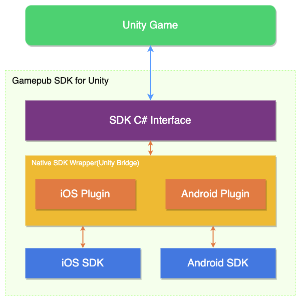

게임펍은 퍼블리싱 사업이 주된 사업으로 다양한 개발사와 협업하여 게임을 출시합니다.<br>
이에 따라 반복적인 기능들을 필요로 했고 나아가 사용자 경험을 쌓아 수익창출에 도움이 될 수 있는 SDK 가 필요했습니다.

## 개요

기존에 일회성으로 만들어 사용하던 Unity SDK 이 있었으나 각 써드파티들에 대한 의존성, 확장성, 호환성 이슈들이 예측됐고
c# 으로만 개발된 SDK 였기 때문에 네이티브 기능도 사용할 수 가 없었습니다.<br>
그래서 저는 각각 iOS 와 Android 용 네이티브 SDK 를 개발하여 C# 인터페이스를 통해 Unity SDK 를 제공하기로 결정했습니다.
현재 SDK 팀이 앞으로 어떻게 될지 모르겠지만 향후 언리얼 SDK 도 개발 가능하다는 이점을 가져가는 것도 목표중 하나였습니다.

게임펍 SDK 기본 구성 요소는 다음과 같습니다.



## Unity SDK

Unity에서는 그동안 계속해서 [네이티브 플러그인](https://docs.unity3d.com/kr/2021.3/Manual/Plugins.html)에 대한 지원이 발전되고 있었습니다. 이것을 이용해서 Native SDK 와 통신하는
브릿지 프로젝트를 만들었습니다.

### API 요청 방식

* iOS : Unity에서 제공되는 [iOS용 플러그인 빌드](https://docs.unity3d.com/kr/2021.3/Manual/PluginsForIOS.html)방식을 사용하여 각 네이티브 메서드를 호출합니다.
* Android : Unity에서 제공되는 [AndroidJavaObject](https://docs.unity3d.com/ScriptReference/AndroidJavaObject.html)를 사용하여 각 네이티브 메서드를 호출합니다.

=== "iOS interface"
    ```c#
    [DllImport("__Internal")]
    private static extern void login(string identifier);
    public static void Login(string identifier) {
        return login(identifier);
    }
    ```
=== "Android interface"
    ```c#
    public static void Login(string identifier) {
        var androidObject = new AndroidJavaObject("com.gamepubcorp.sdk.WrapperClass");

        object[] param = new object[1];
        param[0] = identifier;

        return androidObject.Call("login", param);
    }
    ```

### API 응답 방식

네트워크 통신이 있는 API 경우엔 비동기 콜백처리가 필요하므로 네이티브 쪽에서 Unity의 메서드를 호출할 수 있어야 합니다.
Unity에서는 Android와 iOS 마찬가지로 UnitySendMessage 메서드를 제공합니다.

UnitySendMessage 의 정의는 다음과 같습니다.

```
UnitySendMessage("GameObjectName1", "MethodName1", "Message to send");
```

* 호출할 대상의 GameObject의 이름
* 호출할 스크립트의 메서드
* 메서드 파라미터 문자열

비동기 콜백을 처리할때는 네이티브 쪽에서 UnitySendMessage 메서드를 호출합니다. 이 메서드를 이용해서 토큰을 식별자로 사용하고, 데이터는 JSON 직렬화 파라미터를 사용해서 전달합니다.

Unity에서 이 콜을 받으려면

* MonoBehaviour 을 상속받는 객체여야 합니다.
* GameObjectName이란 이름은 Unity Hierarchy 즉, 런타임에 올라갈 게임오브젝트 이름이어야 합니다.
* 해당 스크립트내에 MethodName이란 이름의 메서드가 정의되어 있어야 합니다.

식별자를 사용해서 네이티브 API를 호출하고, 동일한 식별자를 UnitySendMessage 메서드를 통해 반환하면 비동기 작업을 호출한 주체를 식별할 수 있습니다.

=== "iOS"
    ```
    UnitySendMessage("NativeListener", "CallbackMethod", "json with identifier");   
    ```
=== "Android"
    ```
    UnityPlayer.UnitySendMessage("NativeListener", "CallbackMethod", "json with identifier")
    ```
=== "Unity"
    ```c#    
    void CallbackMethod(string json) {
        // json 데이터 직렬화
    }
    ```

전달받은 identifier를 확인하면 어떤 API가 호출했는지 알 수 있기 때문에 한 번의 UnitySendMessage 호출로 여러 다수의 API를 처리하는 장점을 갖습니다.<br>
이렇게 이러한 방법을 통해 네이티브와 Unity C# 간에 데이터를 주고 받습니다.

## Android SDK

네이티브 SDK가 Unity용 브릿지 프로젝트를 거쳐 Unity 와 통신하기 때문에 네이티브 SDK 는 maven 에 배포하여
Unity용 브릿지 프로젝트내에서 랩핑하여 사용합니다. 브릿지 프로젝트는 aar 로 빌드되어 유니티 패키지를 통해 배포됩니다.

### 결제 모듈 통합

* 구글
* 원스토어
* 갤럭시스토어

### 네트워크 통신

Retrofit 사용

### Unity에서 연동

Android 플랫폼용 Unity 프로젝트에서는 Gradle 빌드 시스템을 사용합니다.
Resolver 사용

* 커스텀 Gradle 템플릿을 사용해서 의존성 관리
* Target API 지원

## iOS SDK

Objective-C 로 개발했었고 추후 Swift로 전환했습니다.

### 네트워크 통신

### Unity에서 연동

## 배포

jenkins, fastlane

## 가이드 문서

gitbook
