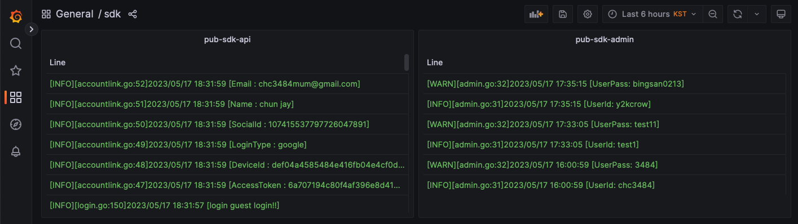
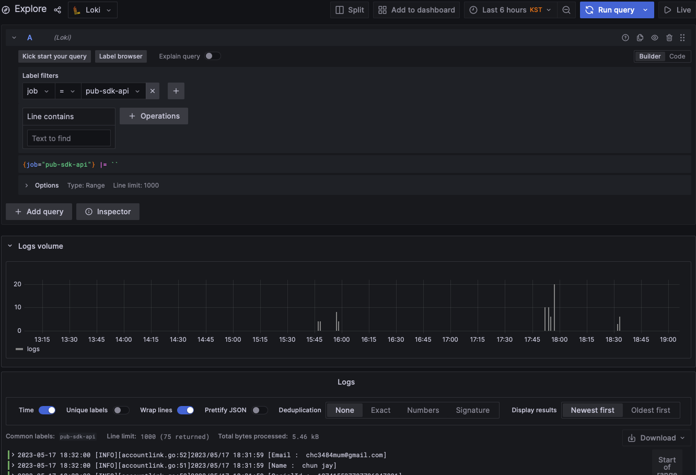
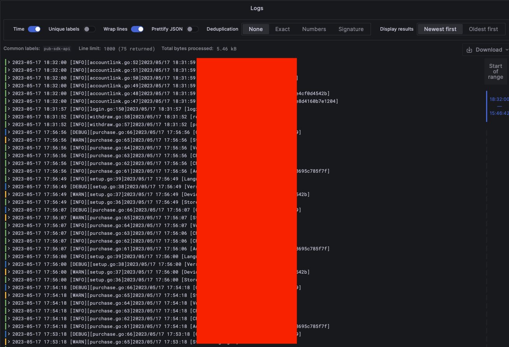
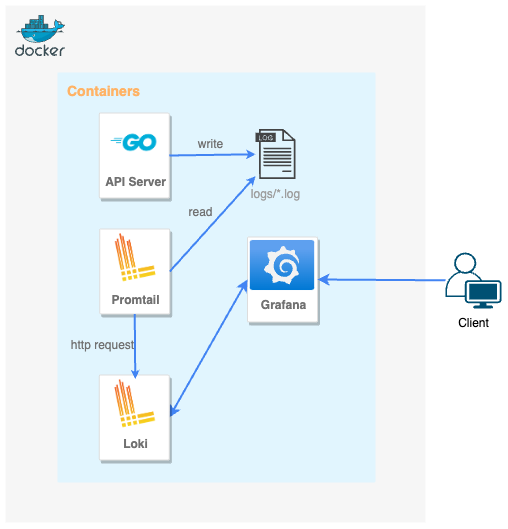

# 장애로그 모니터링 시스템 구축

## 개요

개발중인 SDK API 서버와 Admin 서버에서 심어놓은 로그파일들을 접근하기 용이하도록 시스템을 구축하였습니다.<br>
기존에는 로그를 확인하려면 직접 각각 테스트 서버에 접속해야 하고 파일을 검색하고 키워드는 찾는데 번거로웠습니다.<br>
이러한 불편함을 개선하고자 관련 서비스들의 로그들을 모아 시각화하였습니다.
로그 모니터링 시스템은 서비스별 로그, 시간단위, 키워드 등으로 필터링하여 검색이 가능하고 그래프로도 확인이 가능합니다.
그리고 로키의 쿼리시스템은 많은 양의 로그들도 빠른 속도로 처리해줍니다.

실 서비스에서도 사용하기 용이하도록 Docker Compose 로 환경을 구성했습니다.

* loki
```
Promtail에서 받은 로그를 저장합니다.
```

* promtail
```
로그 파일에서 문자열 데이터를 수집하고 Loki로 보냅니다.
```

* grafana
```
Loki의 데이터를 시각화합니다.
```




## 설계 및 다이어그램



## Loki

Grafana Loki는 다른 logging system과 다르게 log의 label만 indexing 하고 message는 indexing하지 않으므로 더 가볍게 설계됐습니다.<br>
그리고 loki로 전달된 log는 index(label) 와 chunk(message)로 나뉘어 저장됩니다.<br>

특징

* 로그 인덱싱을 위한 효율적인 메모리 사용 : 레이블 집합에 대한 인덱싱
* 멀티 테넌시 : 여러 테넌트가 단일 Loki인스턴스를 사용하게할 수 있음
* LogQL, Loki의 쿼리 언어 : data metric 사용가능한 쿼리 언어
* 확장성 : 대규모 설치를 위한 확장가능한 설계 구조, 각 마이크로서비스 구성요소는 별도의 프로세스로 나누어 구성 가능함
* agent 유연성 : 많은 agent가 플러그인으로 지원함
* grafana 통합 : grafana와 원할하게 통합되어 stack으로 제공