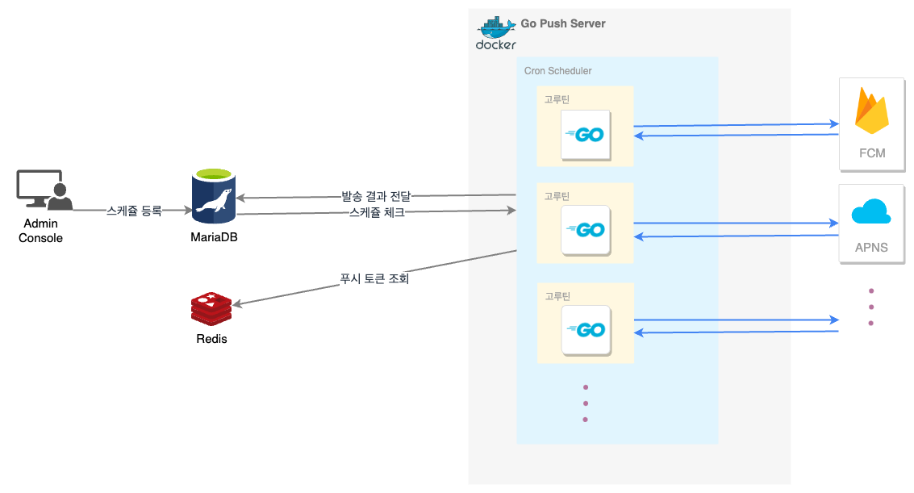

마케팅에 가장 중요한 앱푸시. 앱 푸시를 세밀한 타겟팅으로 보낼 수 있게 해야 한다.

SDK 를 이용하는 프로젝트들에 대해서 범용적으로 사용할 푸시서버를 개발하기로 했다.

안드로이드 경우엔 푸시토큰 iOS 경우엔 디바이스토큰을 수집하는데 디비 부하를 피하기 위해서
레디스를 사용하였다.
스케쥴정보는 admin rdb를 타도록 설계했고 스케쥴 정보(날짜시간 및 타게팅 정보) 조건에 맞는 유저 토큰 조회는 레디스를 타도록 했다.
그리고 API 서버에서 인증 처리시 Redis 푸시 테이블은 조회속도를 줄이기 위해 프로젝트, os, 국가, 스토어별 속성을 갖도록 했고 활성화 유저이면서 푸시 동의를 한 유저만 테이블에 미리 올라오도록 했다.

여러 프로젝트들이 동일한 시간대에 푸시발송을 했을때 지연을 최소화하기 위해서다.

각 프로젝트의 서버키를 가져온다. (타겟팅)

fcm 은 경험상 지연되는 사례를 많이 겪어봐서 fcm, apns 둘다 사용하기로 했고 만약 fcm 지연이 되더라도 apns 는
지연되는 경우에 없기 때문에 장애를 최소화 할 수 있을거라고 생각했다.

상태값은 대기, 진행중, 성공, 실패 로 나뉘며

분산처리는 고루틴 사용

## 개요

1. Admin 에서 앱 푸시 등록(제목, 내용, 대상자 등의 정보 포함)
2. Admin 단에서 푸시 데이터 DB 저장 & 푸시 데이터 퍼블리싱
3. 푸시서버 스케쥴러가 스케쥴정보를 가져와 대상자에 대한 작업 & 대상자와 푸시 데이터 퍼블리싱
4. 푸시를 보내고 푸시 결과 Admin DB에 저장

## 설계 및 다이어그램

## 서버 푸시 모듈 개발

### fcm

fcm api 기능중에 1000건씩 발송이 가능한 그룹발송용 api 가 있었다.
발송 대상자가 만명일 경우 10번에 나눠서 고루틴으로 처리했다. 그리고 DB가 success(푸시 발송된 수), failure(푸시 실패 수)를
업데이트 할 수 있게 응답값을 리턴해주었다.

백그라운드에서 알림팝업 표시 방법

* 서버에서 푸시메시지를 전송할때 notification 이 아닌 data 로 보내야 한다.
* 클라이언트에서는 NotificationManager.IMPORTANCE_HIGH 옵션을 사용해야 한다.

https://firebase.google.com/docs/cloud-messaging/android/receive?hl=ko#handling_messages

### apns

fcm 과 달리 디바이스 토큰당 api 1회 호출. 1:1 발송 시스템 이었다. 그러나 fcm 처럼 지연없이 백발백중 몇번을 발송해도
지연과 누락없이 발송되었다.
그러나 10만건이상 동시 발송될 상황을 고려해 고루틴으로 처리하였다. 고루틴은

## 클라이언트 푸시 연동

### fcm

### apns