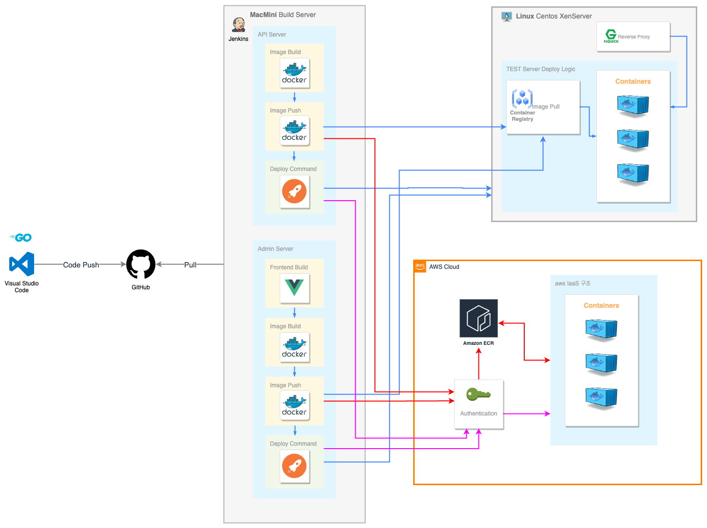

## 개요

기존 개발된 서버의 문제점으로 인해 새로 서버개발을 해야 하는 상황이었습니다.
SDK 클라이언트 업무는 유지보수였기 때문에 서버개발을 생산적인 부분을 돕고자 함께 했습니다.

### 왜 Go를 선택했는가

golang 은 구글이 만들었고 날이 갈수록 더 지원범위가 늘어가고 있습니다. 또한 현재 검증된 서비스가 많이 있습니다.
도커, 쿠버네틱스, 그라파나, 프로메테우스, influxDB, Telegraf 등이 Go 로 제작되었고 드랍박스, 우버, 구글, 넷플릭스 등에서도 Go를 사용하고 있습니다.
그리고 회사 사정상 많은 인력을 보유할 수 없었기 때문에 적은 인원으로 많은 서비스를 감당할 수 있는 언어라고 판단했습니다.

### Go 의 특징

일단 문법에 대한 키워드가 25개 이다보니 학습곡선이 낮습니다. 물론 깊게 들어가면 시간이 필요하지만 이 부분은 어떤 언어든 마찬가지일거라고 생각합니다.

1. 생산성 
    1. 많은 라이브러리와 오픈소스들이 제공되어 강력한 생산성을 보장해줍니다.
    2. 개인적으로는 gui 프로그램이나 웹 admin 도 만들어 봤는데 아주 만족했습니다.

2. 보안
    1. 컴파일언어의 장점인 소스파일을 보일 필요가 없습니다.

3. 배포
    1. 추후에는 도커를 사용했지만 초기에는 바이너리를 직접 배포했었는데 
       다른 언어와는 달리 컴파일된 바이너리 파일 단 한개만으로도 서비스가 가능합니다. 
    3. 윈도우, 리눅스 어디든 쉽게 배포가 가능합니다.

4. 성능
    1. 이건 직접 해보진 않았지만 go안에서 c언어 작성이 가능합니다. 마치 objective c++ 처럼요.
    2. 컴파일속도가 너무 빨라서 인터프리터 언어의 장점을 갖습니다.

5. 가비지 컬렉터
    1. 자원을 효율적으로 사용하기 때문에 성능이 뛰어납니다.
    2. 내부적으로 메모리 관리를 해주는데 왜 자원소모가 큰 모니터링 에이전트들은 go로 만들어졌는지 알 수 있습니다.

## 웹서버 프레임워크 선정

다른 도구들과 호환성을 고려하여 가장 잘 알고 있고 익숙한 [gin](https://github.com/gin-gonic/gin)을 택했습니다.

## 데이터베이스 

mariadb가 메인디비였고 redis는 메인디비 부하를 막아줄 용도로 사용됐으며 mongodb는 로그저장용으로 설계했습니다.

데이터베이스쪽은 전적으로 서버개발자분에게 맡기고 저는 보조적인 역할만 했습니다.

## API

* 소셜 로그인 검증
* 인증 및 회원관리
* 결제 영수증 검증
* 점검 및 업데이트
* 이미지 배너
* 공지사항

### 프레임워크 구조 설계

api 와 db router 의 관계도

### API 문서

테스트 환경과 문서를 동시에 개발할 수 있는 [swagger](https://github.com/swaggo/swag)를 사용했습니다.

## Admin

프론트는 vue.js를 백엔드는 go를 사용하여 개발하였으며 저는 front와 backend 두 프로젝트를 함께 관리할 수 있도록
하는 연동적인 부분과 빌드, 배포 관련해서만 기여하였습니다.

## 배포

빌드 및 배포를 해야 할 서비스가 많기 때문에 자동화에 신경을 많이 썼습니다.
그리고 라이브서버는 aws ECR 을 사용했기 때문에 매번 배포때 마다 인증이 필요합니다.

### AWS CLI

* [aws cli 도구 설치](https://docs.aws.amazon.com/ko_kr/AmazonECR/latest/userguide/getting-started-cli.html)
* [aws configure](https://docs.aws.amazon.com/ko_kr/cli/latest/userguide/cli-configure-files.html) 설정
* [aws cli 로 인증후 배포](https://docs.aws.amazon.com/AmazonECR/latest/userguide/docker-push-ecr-image.html)(12시간 유효)

### 배포 구조

