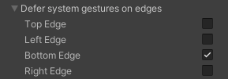

# Unity iOS Home Indicator 활용법

### 개요

iPhone X 이후 기기에서는 홈 버튼 대신 `Home Indicator`가 사용됩니다.

게임에서는 화면 하단에 버튼을 배치하는 경우가 많기 때문에, `Home Indicator` 제스처가 입력을 방해할 수 있습니다.

---

### 해결 방법

Unity의 `Player Settings > Defer System Gestures On Edges`에서 `Bottom Edge`를 활성화하면 하단 시스템 제스처를 바로 실행하지 않고 한 번 더 제스처를 요구하도록 설정할 수 있습니다.

이 설정의 목적은 사용자가 게임 진행 중 하단 버튼을 터치할 때 `Home Indicator` 제스처가 즉시 동작하지 않도록 하여, 게임 입력 간섭을 줄이는 것입니다.

기본적으로는 하단에서 스와이프하면 한 번에 앱 전환 동작이 발생할 수 있지만, 이 옵션을 활성화하면 두 단계 제스처로 동작하게 되어 실수로 앱이 전환되는 상황을 줄일 수 있습니다.

---

### 주의사항

!!! warning
    `Hide home button on iPhone X` 옵션은 함께 활성화하지 않는 편이 좋습니다.

이 옵션은 화면에 입력이 있으면 `Home Indicator`를 표시하고, 일정 시간 입력이 없으면 숨기는 방식입니다.

하지만 하단 입력 간섭 문제를 해결하려는 목적이라면, `Hide home button on iPhone X`보다 `Defer System Gestures On Edges`의 `Bottom Edge` 설정이 더 직접적인 해결 방법입니다.

